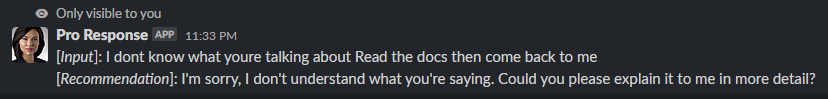
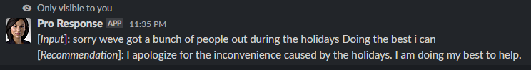
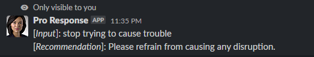

# openai-slackbot-pro-response
Pro Response is a Slackbot designed to enhance written communication within a team environment. Utilizing the OpenAI API, Pro Response can automatically correct spelling, grammar, and punctuation errors, as well as rephrase text to be more friendly and professional. This tool helps to ensure that all written communication within the team is accurate and polished.


## Examples:





## Requirements
- Python 3.6 or higher
- Flask
- OpenAI API key
- Slack API key and channel ID

## Installation
- Clone the repository and navigate to the root directory:
```bash
git clone https://github.com/madithappen/pro-response-slackbot.git
cd pro-response-slackbot
```

- Create a virtual environment and activate it:
```bash
python3 -m venv env
source env/bin/activate
```

- Install the required packages:
```bash
pip install -r requirements.txt
```

- Create a file named .env in the root directory and set the following environment variables:
```bash
SERVICE_IP=<service_ip>
SERVICE_PORT=<service_port>
SLACK_BOT_TOKEN=<slack_bot_token>
SLACK_CHANNEL_ID=<slack_channel_id>
OPENAI_API_KEY=<openai_api_key>
```

## Usage
To start the Slackbot, run the following command:
```bash
python main.py
```

To Build, then start a Docker image, run the following commands:
```bash
# Build the image
docker build -t pro-response .

# Run the image
docker run -p 8123:8123 pro-response
```

The Slackbot will be listening on the `/pr` and `/prr` endpoints of the web service at the IP and port specified in the .env file.

To use the Slackbot, send a message in the form `/pr <your_message>` or `/prr <your_message>` in the Slack channel where the bot is listening. The bot will respond with a rewritten version of the message.


## Slackbot configuration
Please see [create_and_configure_slackbot.md](docs/create_and_configure_slackbot.md) for steps on how to configure the Pro Response slackbot.


## Contributing
Pull requests are welcomed.
